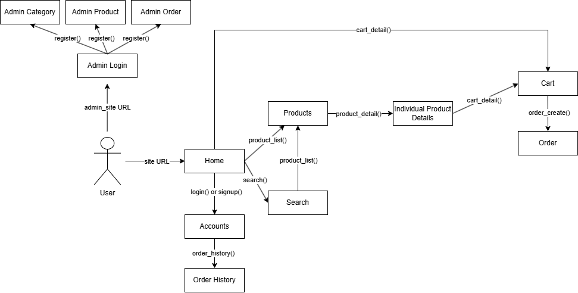

# ecommerce_app
## Isaac Acuna, William Dam, Seamus Flanagan, Joshua Pavon, Joshua Strutzel
### Fashion Project App: Fashion Shop

---

**GitHub Repository:** [https://github.com/jstrutzel01-cmd/ecommerce_app](https://github.com/jstrutzel01-cmd/ecommerce_app)

---

## Project Overiew
Fashion Shop is a modern e-commerce website built with Django.  
It allows users to browse fashion products by category, search for specific items, add products to a shopping cart, and manage their orders.  
The platform is simple, responsive, and provides user authentication, password reset, and order history tracking.

**Product Vision :** To create a new website to sell different fashion products of multiple variants that will be sold online on personal website as well as be distributed to big name stores as well in order to maximize profits and popularity

---
**Functional Requirements:**

|       |          |
| ----- | -------- |
| ID:   | 01       |
| Name: | Homepage |
| Description: | When a user goes to the domain, the homepage should offer a brief description of the product and the company <br> Can go to categories from homepage <br> Can go to search page from homepage <br> Can go to About and Contact Information from homepage |

|       |          |
| ----- | -------- |
| ID:   | 02       |
| Name: | Products |
| Description: | Products are sorted into categories <br> Products have legal information associated with them |

|       |          |
| ----- | -------- |
| ID:   | 03       |
| Name: | Categories Page |
| Description: | Categories page displays categories <br> Can go from categories to the products page displaying specific categories <br> Can go to search page from categories <br> Can go to About and Contact Information from categories |

|       |          |
| ----- | -------- |
| ID:   | 04       |
| Name: | Search Page |
| Description: | Users can search for products based on name or category in the search page |

|       |          |
| ----- | -------- |
| ID:   | 05       |
| Name: | Products Page |
| Description: | Displays products of the category determined from the categories or search pages <br> Can go to the search page <br> Can go to an individual product page |

|       |          |
| ----- | -------- |
| ID:   | 06       |
| Name: | Individual Product Pages |
| Description: | Products displayed can be clicked to view an individual product's specifications, price, reviews, and legal information <br> Individual products can be added to the shopping cart <br> Users can reach the shopping cart |

|       |          |
| ----- | -------- |
| ID:   | 07       |
| Name: | Shopping Cart Page |
| Description: | Displays products that have been added to the shopping cart <br> Users can remove products that were added to the shopping cart <br> Users can choose to purchase all products in the shopping cart <br> Can go to the purchase page |

|       |          |
| ----- | -------- |
| ID:   | 08       |
| Name: | Purchase Page |
| Description: | User can pay for all products by using personal information in the shopping cart and observe shipping costs associated with the order |

|       |          |
| ----- | -------- |
| ID:   | 09       |
| Name: | About and Contact Information Page |
| Description: | Displays company description and legal contact information <br> Can go to the homepage |

**Non-Functional Requirements:**
- **Able to serve up to 10,000 people simultaneously:**  
  The website must be capable of handling a large volume of concurrent users without significant performance degradation, ensuring smooth access for up to 10,000 users at once.

- **Respond within 1 second to each user:**  
  The website should have minimal latency, providing a fast and responsive experience for users with page load times under 1 second.

- **Comply with legality for websites in US, Canada, and UN:**  
  The website must adhere to all relevant laws and regulations for privacy, data security, and commerce in the US, Canada, and under UN guidelines.

- **Should resist basic cybersecurity attacks:**  
  The website must implement security measures to protect against common cyber threats, including but not limited to SQL injection, cross-site scripting (XSS), and cross-site request forgery (CSRF).

- **The website should be available in US, Canada, and UN whenever possible:**  
  The website should be accessible from regions within the US, Canada, and UN member countries, ensuring broad geographical availability.

- **Integrate secure payment methods:**  
  The website should support and integrate secure payment gateways, such as credit card processing or PayPal, ensuring user transactions are encrypted and protected.

**Diagram**



## 🛠️ Quick Start Instructions

Clone the repository, create a virtual environment, install dependencies, migrate the database, and run the server:

```bash
1. Clone repository:
git clone https://github.com/your-username/ecommerce_app.git

2. Change directory to application: 
cd ecommerce_app

3. Create virtual environment: 
python3 -m venv venv

4. Activate virual environment:
source venv/bin/activate  # On Linux/Mac
venv\Scripts\activate     # On Windows

5. Install dependecies:
pip install -r requirements.txt

6. Build DB models:
python manage.py migrate

7. Load data into models: 
python manage.py loaddata initial_data.json 

8. Create admin account:
python manage.py createsuperuser             # (Optional) Create admin account

9. Run project:
python manage.py runserver
